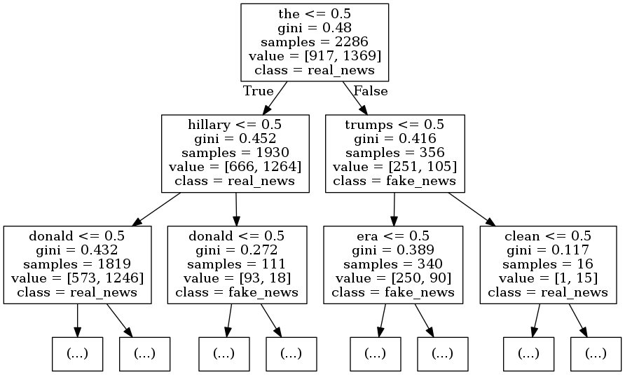

The goal of this mini project is to use the scikit-learn decision tree classifier to classify real vs. fake news headlines. We will use a dataset of 1298 “fake news” headlines (which mostly include headlines of articles classified as biased, etc.) and 1968 “real” news headlines, where the “fake news” headlines are from https://www.kaggle.com/mrisdal/fake-news/data and “real news”headlines are from https://www.kaggle.com/therohk/million-headlines. 

## Implementations include:
* `clean_fake.txt`, `clean_real.txt` cleaned datasets.
* `decision_trees_src_code.py` Python version of the source code.
* `Top_Tree.dot` visualization of the final tree in `.dot` format.
* `Top_Tree.png` visualization of the final tree in `.png` format.
* **`Decision-Trees-Identifying-Fake-News-Headlines.ipynb`** the final notebook.

